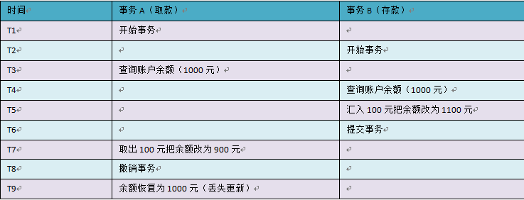

# 事务&ThreadLocal

- [ ] 理解事务的概念
- [ ] 能够在MySQL中使用事务
- [ ] 能够在JDBC中使用事务
- [ ] 能够在DBUtils中使用事务
- [ ] 能够理解ThreadLocal的作用
- [ ] 理解脏读,不可重复读,幻读的概念及解决办法

# 第一章 事务(Transaction)

## **事务四大特征(ACID) : 原子性，一致性，隔离性，持久性**

Transaction 也就是所谓的事务了，通俗理解就是一件事情。

* 从小，父母就教育我们，做事情要有始有终，不能半途而废。 
* ==事务也是这样，不能做一半就不做了，要么做完，要么就不做。==
* ==也就是说，事务必须是一个不可分割的整体==，就像我们在化学课里学到的原子，原子是构成物质的最小单位。
* 于是，人们就归纳出事务的第一个特性：**==原子性（Atomicity）==**。


特别是在数据库领域，事务是一个非常重要的概念，除了原子性以外，它还有一个极其重要的特性，那就是：==**一致性（Consistency）**。也就是说，执行完数据库操作后，数据不会被破坏。==

* 打个比方，如果从 A 账户转账到 B 账户，不可能出现A 账户扣了钱，而 B 账户没有加钱的情况。
* 如果出现了这类事情，我们一定会非常气愤，什么 diao 银行啊！


当我们编写了一条 update 语句，提交到数据库的一刹那间，有可能别人也提交了一条 delete 语句到数据库中。也许我们都是对同一条记录进行操作，可以想象，如果不稍加控制，就会出大麻烦来。==我们必须保证数据库操作之间是“隔离”的（线程之间有时也要做到隔离），彼此之间没有任何干扰。这就是：**隔离性（Isolation）**==。

* 要想真正的做到操作之间完全没有任何干扰是很难的，于是乎，每天上班打酱油的数据库专家们，开始动脑筋了，“我们要制定一个规范，让各个数据库厂商都支持我们的规范！”，这个规范就是：**==事务隔离级别（Transaction Isolation Level）==**。能定义出这样牛逼的规范真的挺不容易的，其实说白了就四个级别：

``` properties
  1.READ_UNCOMMITTED
  2.READ_COMMITTED
  3.REPEATABLE_READ
  4.SERIALIZABLE
  
  不要纠结单词的含义(只是一种级别的代表), 从上往下，级别越来越高，并发性越来越差，安全性越来越高，反之则反。
```


==当我们执行一条 insert 语句后，数据库必须要保证有一条数据永久地存放在磁盘中，这个也算事务的一条特性， 它就是：**持久性（Durability）。**==

**归纳一下，以上一共提到了事务的 4 条特性，把它们的英文单词首字母合起来就是：ACID，这个就是传说中的“事务 ACID 特性”！**

```properties
原子性（Atomicity）:事务必须是一个不可分割的整体, 不能做一半就不做了，要么做完，要么就不做
一致性（Consistency）:执行完数据库操作后，数据不会被破坏
隔离性（Isolation）: 要保证数据库操作之间是“隔离”的，彼此之间没有任何干扰
持久性（Durability）:当我们执行一条 insert 语句后，数据库必须要保证有一条数据永久地存放在磁盘中
```


## 事务隔离级别

四个特性当中，其实最难理解的反倒不是一致性，而是隔离性。

隔离性是保证一致性的重要手段，是工具，使用它不能有半点差池，否则后果自负！所以，数据库行业专家们都要来研究所谓的事务隔离级别了。

```properties
  1.READ_UNCOMMITTED
  2.READ_COMMITTED
  3.REPEATABLE_READ
  4.SERIALIZABLE
```

所定义这四个级别就是为了解决数据在高并发下所产生的问题，那又有哪些问题呢？

* 三类数据读问题

    **1. Dirty Read（脏读）**

    **2. Unrepeatable Read（不可重复读）**

    **3. Phantom Read（幻读）**

* 两类数据更新问题

    **1.第一类丢失更新**

    **2.第二类丢失更新**


### 脏读

其实也就是我们经常说的“垃圾数据”了。比如说，有两个事务，它们在并发执行。用类似的例子来说明：


余额应该为 1100 元才对！请看 T6 时间点，事务 A 此时查询余额为 900 元，这个数据就是脏数据，它是事务 A 造成的，明显事务没有进行隔离，渗过来了，乱套了。

==所以脏读这件事情是非常要不得的，一定要解决掉！让事务之间隔离起来才是硬道理。==


### 不可重复读

用类似的例子来说明


事务 A 其实除了查询了两次以外，其他什么事情都没有做，结果钱就从 1000 变成 0 了，这就是重复读了。可想而知，这是别人干的，不是我干的。其实这样也是合理的，毕竟事务 B 提交了事务，数据库将结果进行了持久化，所以事务 A 再次读取自然就发生了变化。

==这种现象基本上是可以理解的，但在有些变态的场景下却是不允许的。毕竟这种现象也是事务之间没有隔离所造成的，但我们对于这种问题，似乎可以忽略。==


### 幻读

用类似的例子来说明


银行工作人员，每次统计总存款，都看到不一样的结果。不过这也确实也挺正常的，总存款增多了，肯定是这个时候有人在存钱。但是如果银行系统真的这样设计，那算是玩完了。这同样也是事务没有隔离所造成的，但对于大多数应用系统而言，这似乎也是正常的，可以理解，也是允许的。

银行里那些恶心的那些系统，要求非常严密，统计的时候，甚至会将所有的其他操作给隔离开，这种隔离级别就算非常高了（估计要到 SERIALIZABLE 级别了）。


### 第一类丢失更新

A事务撤销时，把已经提交的B事务的更新数据覆盖了。这种错误可能造成很严重的问题，通过下面的账户取款转账就可以看出来：



但是，在当前的四种任意隔离级别中，都不会发生该情况，不然绝对乱套，我都没提交事务只是撤销，就把别人的给覆盖了，这也太恐怖了。


### 第二类丢失更新

B事务覆盖A事务已经提交的数据，造成A事务所做操作丢失


### 小结

**归纳一下，以上提到了事务并发所引起的跟读取数据有关的问题，各用一句话来描述一下：**

**三类数据读问题**

  **1.脏读：事务 A 读取了事务 B ==未提交==的数据，并在这个基础上又做了其他操作。**

  **2.不可重复读：事务 A 读取了事务 B ==已提交==的更改数据。**

  **3.幻读：事务 A 读取了事务 B ==已提交==的新增数据。**

**==第一条是坚决抵制的，后两条在大多数情况下可不作考虑。==**


**每种事务隔离级别能处理怎样的事务并发问题：**


根据我们的实际需求，再参考这张表，最后确定事务隔离级别，应该不再是一件难事了。

* MySQL数据库的默认事务隔离级别是 REPEATABLE_READ
* Oracle数据库的默认事务隔离级别是  READ_COMMITTED


**查询数据库的隔离级别**

```mysql
show variables like '%isolation%';
或
select @@tx_isolation;
```


**设置数据库的隔离级别**

- `set session transactionisolation level` 级别字符串
- 级别字符串：`readuncommitted`、`read committed`、`repeatable read`、`serializable`
- 例如：`set session transaction isolation level read uncommitted;`


# 第二章 事务操作

- 事务: 指的是逻辑上的一组操作,组成这组操作的各个单元要么全都成功,要么全都失败.
- 事务作用：保证在一个事务中多次SQL操作要么全都成功,要么全都失败.

## 1.1 mysql事务操作

| sql语句             | 描述   |
| ----------------- | ---- |
| start transaction | 开启事务 |
| commit            | 提交事务 |
| rollback          | 回滚事务 |

- 准备数据

```mysql
# 创建账号表
create table account(
	id int primary key auto_increment,
	name varchar(20),
	money double
);
# 初始化数据
insert into account values (null,'jack',10000);
insert into account values (null,'rose',10000);
insert into account values (null,'tom',10000);
```

- 操作
  - MYSQL中可以有两种方式进行事务的管理：
    - 自动提交：MySql默认自动提交。即执行一条sql语句提交一次事务。
    - 手动提交：先开启，再提交
- 手动提交

```mysql
start transaction;
update account set money=money-1000 where name='jack';
update account set money=money+1000 where name='rose';
commit;
#或者
rollback;
```

## 1.2 jdbc事务操作

| Connection 对象的方法名         | 描述   |
| ------------------------- | ---- |
| conn.setAutoCommit(false) | 开启事务 |
| conn.commit()             | 提交事务 |
| conn.rollback()           | 回滚事务 |

> 代码演示

```java
/*
JDBC 的事务操作
 */
public class TransactionDemo {

    /*
    1.获得连接
    2.开始事务
    3. 具体的sql操作(加钱, 减钱)
    4. 提交事务
    5.如果出现异常, 回滚事务
    6.释放资源
     */
    @Test
    public void test1() throws SQLException {


        Connection conn = null;
        try {
            // 1.获得连接
            conn = DruidUtils.getConnetion();
            //2.开始事务
            conn.setAutoCommit(false);
            //3. 具体的sql操作(加钱, 减钱)
            //减钱
            String sql = "update account set money=money-? where name=?";
            PreparedStatement pstat = conn.prepareStatement(sql);
            pstat.setDouble(1,1000);
            pstat.setString(2,"jack");
            pstat.executeUpdate();

            //模拟错误
            //int n = 1/0;

            //加钱
            sql = "update account set money=money+? where name=?";
            PreparedStatement pstat2 = conn.prepareStatement(sql);
            pstat2.setDouble(1,1000);
            pstat2.setString(2,"rose");
            pstat2.executeUpdate();
            // 4. 提交事务
            conn.commit();

        } catch (Exception e) {
            e.printStackTrace();
            //5.如果出现异常, 回滚事务
            conn.rollback();
        }
    }
}
```

## 1.3 DBUtils事务操作

| Connection对象的方法名                                       | 描述                                   |
| ------------------------------------------------------------ | -------------------------------------- |
| conn.setAutoCommit(false)                                    | 开启事务                               |
| new QueryRunner()                                            | 创建核心类，不设置数据源(手动管理连接) |
| query(conn , sql , handler, params )  或   <br />update(conn, sql , params) | 手动传递连接， 执行SQL语句CRUD         |
| DbUtils.commitAndCloseQuietly(conn)                          | 提交并关闭连接，不抛异常               |
| DbUtils.rollbackAndCloseQuietly(conn)                        | 回滚并关闭连接，不抛异常               |

> 代码演示

```java
/*
DBUtils 的事务操作
 */
public class TransactionDemo2 {

    /*
    1.获得连接
    2.开始事务
    3.具体的sql操作(加钱, 减钱)
    4.提交事务 ,释放资源
    5.如果出现异常, 回滚事务释放资源
     */
    @Test
    public void test1() throws SQLException {
        Connection conn = null;
        try {
            //1.获得连接
            conn =  DruidUtils.getConnetion();
            // 2.开始事务
            conn.setAutoCommit(false);
            // 3.具体的sql操作(加钱, 减钱)
            QueryRunner qr = new QueryRunner();
            //减钱
            String sql = "update account set money=money-? where name=?";
            qr.update(conn, sql, 1000, "jack");
            //模拟错误
            int n =1/0;
            //加钱
            sql = "update account set money=money+? where name=?";
            qr.update(conn, sql, 1000, "rose");
            //4.提交事务 ,释放资源
            DbUtils.commitAndCloseQuietly(conn);
        } catch (Exception e) {
            e.printStackTrace();
            //5.如果出现异常, 回滚事务释放资源
            DbUtils.rollbackAndCloseQuietly(conn);
        }
    }
}
```


# 第三章 JavaEE分层开发思想

## 3.1 分层开发思想


- 开发中，常使用分层思想
  - 不同的层次结构分配不同的解决过程，各个层次间组成严密的封闭系统


- 分层的目的是：
  - 解耦
  - 可维护性
  - 可重用性
- 不同层次，使用不同的包表示
  - com.itheima                  公司域名倒写
  - com.itheima.dao               dao层
  - com.itheima.service        service层
  - com.itheima.pojo            javabean
  - com.itheima.utils              工具


## 3.2 案例：使用分层开发思想, 完成转账

### 分析


### 代码实现

- 步骤1：编写入口程序

```java
/**
 * 程序执行的入口
 */
public class TestAccount {
    /*
    1. 模拟数据  扣款人  收款人  金额
    2. 调用AccountService中 转账方法
    3. 打印 转账后的结果 ( 成功,  失败)
     */
    public static void main(String[] args) {
        // 1. 模拟数据  扣款人  收款人  金额
        String outUser = "jack"; //扣款人
        String inUser = "rose"; //收款人
        double money = 1000; // 金额
        //2. 调用AccountService中 转账方法
        AccountService service = new AccountService();
        try {
            service.transfer(outUser, inUser, money);
            // 打印 转账后的结果 ( 成功,  失败)
            System.out.println("转账成功");
        } catch (Exception e) {
            e.printStackTrace();
            System.out.println("转账失败");
        }
    }
}

```

- service层

```java
public class AccountService {

    /**
     * 转账方法
     * 参数1 : 扣款人
     * 参数2 : 收款人
     * 参数3 : 金额
     */
    public void transfer(String outUser, String inUser, double money) throws Exception{
        /*
        事务控制, 保证 转账的操作 结果的一致性
        1. 获取Connection对象
        2. 手动开启事务
        3. 执行 减钱 加钱操作
        4. 提交事务
        5. 如果出现异常, 回滚事务
         */
        Connection conn = null;
        try {
            // 1. 获取Connection对象
            conn = DruidUtils.getConnetion();
            //2. 手动开启事务
            conn.setAutoCommit(false);
            //3. 执行 减钱 加钱操作
            //调用dao层方法 完成 减钱 加钱操作
            AccountDao dao = new AccountDao();
            //减钱
            dao.out(conn, outUser, money);

            //模拟异常的操作
            int n = 1/0;

            //加钱操作
            dao.in(conn, inUser, money);

            // 4. 提交事务
            conn.commit();
        } catch (Exception e) {
            e.printStackTrace();
            // 5. 如果出现异常, 回滚事务
            conn.rollback();
        }

    }
}
```

- dao层

```java
public class AccountDao {

    /**
     * 扣钱方法
     * @param outUser 扣钱人
     * @param money 金额
     */
    public void out(Connection conn, String outUser, double money) throws SQLException {
        String sql = "update account set money=money-? where name=?";

        QueryRunner qr = new QueryRunner();
        qr.update(conn, sql, money, outUser);
    }

    /**
     * 加钱方法
     * @param inUser 收钱人
     * @param money 金额
     */
    public void in(Connection conn, String inUser, double money) throws SQLException {
        String sql = "update account set money=money+? where name=?";

        QueryRunner qr = new QueryRunner();
        qr.update(conn, sql, money, inUser);
    }

}
```

# 第四章 ThreadLocal

## 4.1 事务传递Connection引发的思考

在“事务传递Connection参数案例”中，我们必须传递Connection对象，才可以完成整个事务操作。如果不传递参数，是否可以完成？

在JDK中给我们提供了一个工具类：ThreadLocal，此类可以在当前线程中共享数据。

`java.lang.ThreadLocal `该类提供了线程局部 (thread-local) 变量，用于在当前线程中共享数据。

## 4.2  ThreadLocal类的使用

java.lang.ThreadLocal 该类提供了线程局部(thread-local) 变量，用于在当前线程中共享数据。ThreadLocal工具类底层就是相当于一个Map，key存放的当前线程，value存放需要共享的数据。

| 时间 | 线程A(已开启)               | 线程B(已开启)               |
| ---- | --------------------------- | --------------------------- |
| T1   | 创建ThreadLocal<String>对象 |                             |
| T2   | 调用set("传智播客")  存入值 |                             |
| T3   | 调用get()  获取值           |                             |
| T4   |                             | 调用get()获取值, 结果为null |


举例

```java
public class ThreadLocalDemo {

    public static void main(String[] args) {
        ThreadLocal<String>  mainThread = new ThreadLocal<>();

        mainThread.set("传智播客");

        System.out.println(mainThread.get());//传智播客

        new Thread(()->{
            System.out.println(mainThread.get());//null
        }).start();
    }
}
```

* 源码剖析


 结论：向ThreadLocal对象中添加的数据只能在当前线程下使用。


## 4.3 案例:使用ThreadLocal完成转账 

#### 分析


#### 代码实现

 **工具类**

```java
/**
 * 阿里巴巴的连接池 Druid 工具类
 */
public class DruidUtils {
    /*
    1. 加载 druid.properties 配置文件
    2. 创建 Druid 连接池对象
    3. 提供 获得 连接池对象的方法
    4. 提供 通过ThreadLocal 从连接池中 获取连接对象Connection的 方法
    */

    public static DataSource ds = null;

    //给当前线程绑定 连接
    private static ThreadLocal<Connection> local = new ThreadLocal<Connection>();

    static {
        try {
            //1. 加载 druid.properties 配置文件
            InputStream is = DruidUtils.class.getClassLoader().getResourceAsStream("druid.properties");
            Properties prop = new Properties();
            prop.load(is);
            //2. 创建 Druid 连接池对象
           ds = DruidDataSourceFactory.createDataSource(prop);
        } catch (Exception e) {
            e.printStackTrace();
        }
    }

    /*
    3. 提供 获得 连接池对象的方法
     */
    public static DataSource getDataSource(){
        return ds;
    }

    /*
    4. 提供 通过ThreadLocal 从连接池中 获取连接对象Connection的 方法
    步骤: 
    1.从ThreadLocal获得连接
    2.如果没有, 从连接池获得连接, 并保存到ThreadLocal中
    3.获得连接,返回即可
     */
    public static Connection getConnection(){
        try {
            //#1从当前线程中， 获得已经绑定的连接
            Connection conn = local.get();
            if(conn == null){
                //#2 第一次获得，绑定内容 – 从连接池获得
                conn = ds.getConnection();
                //#3 将连接存 ThreadLocal
                local.set(conn);
            }
            return conn; //获得连接
        } catch (Exception e) {
            //将编译时异常 转换 运行时 ， 以后开发中运行时异常使用比较多的。
            throw new RuntimeException(e);
        }
    }
}
```

service层

```java
public class AccountService {

    /**
     * 业务层事务管理转账的方法
     */
    public void transfer(String from, String to, double money) {
        //调用dao层
        AccountDao accountDao = new AccountDao();

        //DBUtils使用的方法
        Connection conn = null;

        try {
            //获得连接
            conn = DruidUtils.getConnection();
            //设置事务不自动提交
            conn.setAutoCommit(false);
            //调用持久层
            accountDao.outMoney(from,money);

            //如果有异常
            //int a = 1 / 0 ;

            accountDao.inMoney(to,money);
            //提交事务,并安静的关闭连接
            DbUtils.commitAndCloseQuietly(conn);
        } catch (SQLException e) {
            //有异常出现时，回滚事务，并安静的关闭连接
            DbUtils.rollbackAndCloseQuietly(conn);
            e.printStackTrace();
        }
    }
}
```

dao层

```java
public class AccountDao {

    /**
     * 付款方法
     * @param from 付款人
     * @param money 金额
     */
    public void outMoney(String from, double money) {

        QueryRunner qr = new QueryRunner();
        try {
            Connection conn = DruidUtils.getConnection();
            String sql = "update account set money = money - ? where name = ?";
            qr.update(conn, sql, money,from);
        } catch (SQLException e) {
            e.printStackTrace();
        }
    }

    /**
     * 收款方法
     * @param to 收款人
     * @param money 金额
     */
    public void inMoney(String to, double money) {

        QueryRunner qr = new QueryRunner();
        try {
            Connection conn = DruidUtils.getConnection();
            String sql = "update account set money = money + ? where name = ?";
            qr.update(conn, sql, money,to);
        } catch (SQLException e) {
            e.printStackTrace();
        }
    }
}

```


