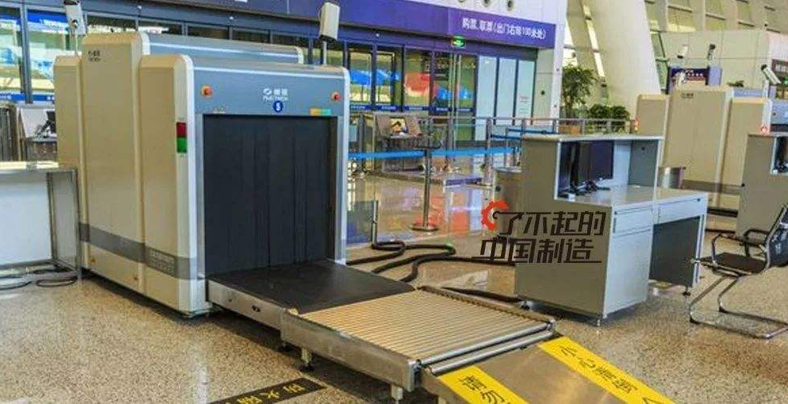
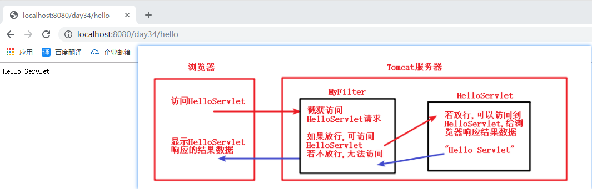
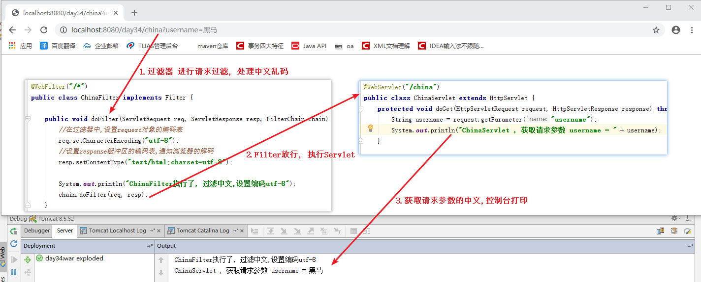
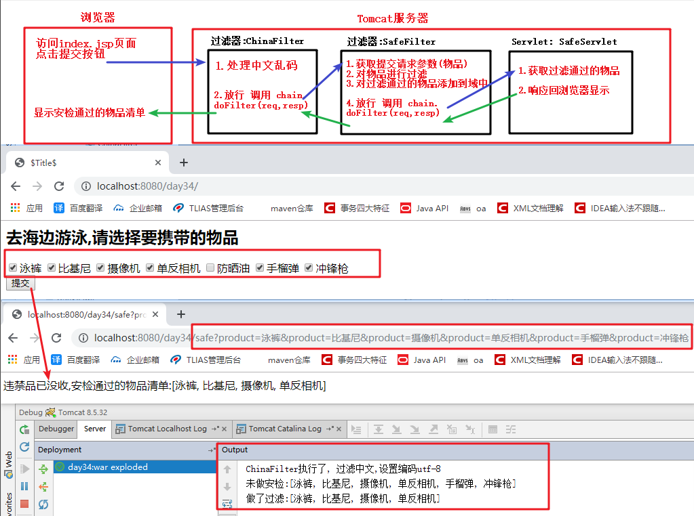
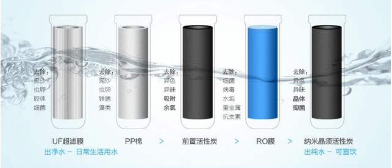
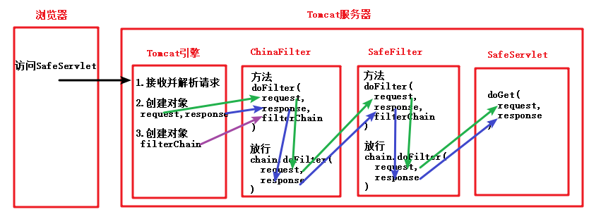
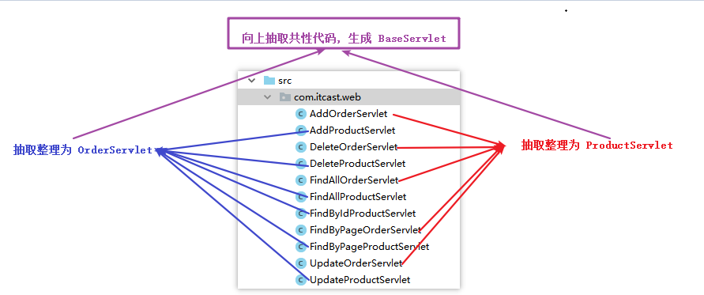

# 一. 过滤器Filter

## Filter概念

  过滤器: 过筛子,符合条件的过去,不符合条件不能过去.

  生活比喻: 安检,检查安全的人与物才可以通过放行

  程序: 客户端需要访问服务器的目标资源,在客户端和服务器资源之间设置过滤器, 符合要求放行




## Filter的入门程序

### 需求: 

* 浏览器要访问HelloServlet
* 途径过滤期MyFilter, 若MyFilter放行,可执行访问到HelloServlet; 若不放行,无法访问HelloServlet

### 执行图解:



### 实现步骤

1. 编写Servlet, 在web.xml配置Servlet访问路径
2. 编写Filter,定义类, 实现接口Filter, 实现接口中抽象方法, 在web.xml配置Filter的访问过滤路径 

#### 代码: HelloServlet

```java
/**
 * @author likepei
 * @data 2019/7/14 0:29
 * @description 用于Filter入门案例演示
 */
public class HelloServlet extends HttpServlet {
    protected void doGet(HttpServletRequest request, HttpServletResponse response) throws ServletException, IOException {
        //控制台打印
        System.out.println("HelloServlet 执行了");
        //浏览器响应
        response.getWriter().println("Hello Servlet");
    }

    protected void doPost(HttpServletRequest request, HttpServletResponse response) throws ServletException, IOException {
        doGet(request, response);
    }
}

```

#### 代码: MyFilter

```java
/**
 * @author likepei
 * @data 2019/7/14 0:31
 * @description 用于演示Filter入门案例
 */
public class MyFilter implements Filter {
    public void destroy() {
    }

    public void doFilter(ServletRequest req, ServletResponse resp, FilterChain chain) throws ServletException, IOException {
        System.out.println("MyFilter 执行了");

        //执行过滤后放行, 进行后续的请求访问
        chain.doFilter(req, resp);
    }

    public void init(FilterConfig config) throws ServletException {

    }

}
```

#### 代码: web.xml

```xml
<?xml version="1.0" encoding="UTF-8"?>
<web-app xmlns="http://xmlns.jcp.org/xml/ns/javaee"
         xmlns:xsi="http://www.w3.org/2001/XMLSchema-instance"
         xsi:schemaLocation="http://xmlns.jcp.org/xml/ns/javaee http://xmlns.jcp.org/xml/ns/javaee/web-app_3_1.xsd"
         version="3.1">
    <!--配置servlet-->
    <filter>
        <filter-name>my</filter-name>
        <filter-class>com.itheima.filter.MyFilter</filter-class>
    </filter>
    <filter-mapping>
        <filter-name>my</filter-name>
        <url-pattern>/*</url-pattern>
    </filter-mapping>

    <!--配置Servlet-->
    <servlet>
        <servlet-name>hello</servlet-name>
        <servlet-class>com.itheima.servlet.HelloServlet</servlet-class>
    </servlet>
    <servlet-mapping>
        <servlet-name>hello</servlet-name>
        <url-pattern>/hello</url-pattern>
    </servlet-mapping>

</web-app>
```


## Filter的生命周期

- 过滤器对象的创建,是Tomcat服务器启动

  - init(FilterConfig config)过滤器对象被创建的时候调用,FilterConfig 对象tomcat引擎创建

- 过滤器执行过滤的方法,过滤被访问资源的时候,必须是被过滤器过滤器的资源

  - doFilter(request,response)

- 过滤器对象销毁的方法,销毁之前调用,服务器关闭

  - destroy()

  ​

## Filter的url-pattern配置

- 完全匹配

```xml
<!-- 
    过滤资源,只有hello
    绝对匹配 <url-pattern>/hello</url-pattern>
    只能过滤指定的资源
-->
<url-pattern>/hello</url-pattern>
```

- 目录匹配

```xml
<!--
   目录匹配,过滤器中最常见
   /abc/*  过滤abc目录下的所有资源
   一次过滤一片资源
   过滤后台资源 /admin/*
-->
<url-pattern>/admin/*</url-pattern>
```

- 后缀名匹配

```xml
<!-- 
  后缀名匹配,一般不使用
  *.jsp  访问所有jsp文件
-->
<url-pattern>*.jsp</url-pattern>
```


## 注解配置Filter

@WebFilter(urlPatterns="/过滤资源")

```java
@WebFilter("/*")
public class ChinaFilter implements Filter {
    //代码省略...
}
```


## Filter 处理中文乱码

### 需求: 

​	使用过滤器Filter, 处理所有请求的中文乱码

### 执行图解:



### 代码: ChinaServlet

```java
/**
 * @author likepei
 * @data 2019/7/14 0:46
 * @description 获取请求参数中的中文
 */
@WebServlet("/china")
public class ChinaServlet extends HttpServlet {
    protected void doGet(HttpServletRequest request, HttpServletResponse response) throws ServletException, IOException {
        String username = request.getParameter("username");
        System.out.println("ChinaServlet , 获取请求参数 username = " + username);
    }

    protected void doPost(HttpServletRequest request, HttpServletResponse response) throws ServletException, IOException {
        doGet(request, response);
    }
}
```

### 代码: ChinaFilter

```java
/**
 * @author likepei
 * @data 2019/7/14 0:45
 * @description 过滤中文,设置编码utf-8
 */
@WebFilter("/*")
public class ChinaFilter implements Filter {

    public void doFilter(ServletRequest req, ServletResponse resp, FilterChain chain) throws ServletException, IOException {
        //在过滤器中,设置request对象的编码表
        req.setCharacterEncoding("utf-8");
        //设置response缓冲区的编码表,通知浏览器的解码
        resp.setContentType("text/html;charset=utf-8");

        System.out.println("ChinaFilter执行了, 过滤中文,设置编码utf-8");
        chain.doFilter(req, resp);
    }

    public void init(FilterConfig config) throws ServletException {

    }

    public void destroy() {
    }
}
```


## 案例: 物品安全检查

### 需求:

实现对违禁品 进行过滤

### 执行图解:



### 代码: index.jsp

```jsp
  <body>
      <form action="${pageContext.request.contextPath}/safe" method="get">
          <h2>去海边游泳,请选择要携带的物品</h2>
          <input type="checkbox" name="product" value="泳裤" />泳裤
          <input type="checkbox" name="product" value="比基尼"/>比基尼
          <input type="checkbox" name="product" value="摄像机"/>摄像机
          <input type="checkbox" name="product" value="单反相机"/>单反相机
          <input type="checkbox" name="product" value="防晒油"/>防晒油
          <input type="checkbox" name="product" value="手榴弹"/>手榴弹
          <input type="checkbox" name="product" value="冲锋枪"/>冲锋枪
          <br />
          <input type="submit" value="提交" />
      </form>
  </body>
```

### 代码: SafeServlet

```java
/**
 * @author likepei
 * @data 2019/7/14 0:10
 * @description 安检通过,给浏览器响应结果
 */
@WebServlet("/safe")
public class SafeServlet extends HttpServlet {
    protected void doGet(HttpServletRequest request, HttpServletResponse response) throws ServletException, IOException {
        response.getWriter().print("违禁品已没收,安检通过的物品清单:" + request.getAttribute("list"));
    }

    protected void doPost(HttpServletRequest request, HttpServletResponse response) throws ServletException, IOException {
        doGet(request, response);
    }
}
```

### 代码: SafeFilter

```java
/**
 * @author likepei
 * @data 2019/7/13 23:50
 * @description 携带商品的安全检查
 */
@WebFilter("/safe")
public class SafeFilter implements Filter {
    
    public void doFilter(ServletRequest req, ServletResponse resp, FilterChain chain) throws ServletException, IOException {
        //获取请求参数
        String[] products = req.getParameterValues("product");
        //物品过滤
        System.out.println("未做安检:" + Arrays.toString(products));
        List<String> list =Stream.of(products).filter(item -> !item.equals("手榴弹")).filter(item -> !item.equals("冲锋枪")).collect(Collectors.toList());
        System.out.println("做了过滤:" + list);
        //过滤后的物品 添加到域中
        req.setAttribute("list",list);
        chain.doFilter(req, resp);
    }

    public void destroy() {
    }

    public void init(FilterConfig config) throws ServletException {
    }
}
```


## 过滤器链 FilterChain的执行过程

生活中的过滤器链: 从 脏水 --> -->UF超滤膜 --> PP棉 -->前置活性炭 --> RO膜 --> 纳米晶须活性炭 --> 出纯水 



**Filter中的过滤器链 FilterChain:** 由Tomcat引擎创建对象

**作用:** 维护过滤器执行顺序



**小结:** Servlet中doGet方法参数 request, response对象, 由Tomcat引擎创建, 经过多个过滤器一层层传递 


## 多个过滤器的先后执行顺序

### web.xml配置

  和配置文件的编写顺序决定运行的顺序,准确的说法是,根据mapping的顺序决定 (由上到下执行)

### 注解开发

  注解开发没有配置文件的

  按照类名的自然顺序决定: A-B-C

  如果存在配置文件,配置文件优先


# 二. 监听器Listener

## Listener概述


 监听器Listener 是 监听某个组件变化的对象.

* 事件源是固定的,主要是request, session, servletcontext域对象

* 监听的是域对象变化

  * 对象的创建和销毁, 域对象中存储的数据变化

* 第一个维度划分: 

  * 监听的域对象request, session, servletcontext 

    | 域对象         | 监听器                 |
    | -------------- | ---------------------- |
    | request        | ServletRequestListener |
    | session        | HttpSessionListener    |
    | servletcontext | ServletContextListener |

* 第二个维度划分: 

  * 监听的域对象的状态


## ServletContext监听器入门

用于监听 servletcontext域对象, 对象的创建和销毁, 域对象中存储的数据变化

### 实现步骤

* 创建类实现监听器接口 ServletContextListener
* 重写抽象方法
* 注解方式 配置 Listener 

```java
@WebListener
public class MyServletContextListener implements ServletContextListener {
    @Override
    /**
     *  ServletContext对象,被创建,调用
     */
    public void contextInitialized(ServletContextEvent servletContextEvent) {
        System.out.println("ServletContext域对象创建");
    }

    @Override
    /**
     *   ServletContext对象,被销毁前调用
     */
    public void contextDestroyed(ServletContextEvent servletContextEvent) {
        System.out.println("ServletContext域对象销毁");
    }
}
```

* web.xml配置方式 Listener 

```xml
<listener>
    <listener-class>com.itheima.listener.MyServletContextListener</listener-class>
</listener>
```


## 监听器事件对象 ServletContextEvent

ServletContextEvent: 是ServletContext域对象的事件对象, 此对象由tomcat引擎创建ServletContext

* 方法:
  * `Object getSource() `获取到被监听的事件源
  * `ServletContext getServletContext()` 获取到被监听的事件源
* 小结:
  * 两个方法 除了返回值外,功能实现是一致的, 设计目的为了通用性
  * 其他的监听器事件对象(HttpSessionEvent, ServletRequestEvent), 都有共同的方法 getSource()

```java
@WebListener
public class MyServletContextListener implements ServletContextListener {
    @Override
    /**
     *  ServletContext对象,被创建,调用
     */
    public void contextInitialized(ServletContextEvent servletContextEvent) {
        System.out.println("ServletContext域对象创建");
        ServletContext context = (ServletContext) servletContextEvent.getSource();
        System.out.println(context);

        ServletContext servletContext = servletContextEvent.getServletContext();
        System.out.println(servletContext);
    }

    @Override
    /**
     *   ServletContext对象,被销毁前调用
     */
    public void contextDestroyed(ServletContextEvent servletContextEvent) {
        System.out.println("ServletContext域对象销毁");
    }
}
```


# 三. Servlet抽取

## **开发中的问题:** 

传统方式的开发一个请求对应一个Servlet:这样的话会导致一个模块的Servlet过多,导致整个项目的Servlet都会很多.  能不能做一个处理?让一个**模块**用一个Servlet处理请求.   当前是商品模块, 就创建一个商品Servlet

- 传统方式

  查询所有的商品 :http://localhost:8080/day32/findAll

  添加商品:	   :http://localhost:8080/day32/add

  删除商品    	   :http://localhost:8080/day32/delete


- 以模块为单位创建Servlet, 当前是创建ProductServlet

  查询所有的商品 :http://localhost:8080/day32/productServlet?method=findAll

  添加商品:	   :http://localhost:8080/day32/productServlet?method=add

  删除商品    	   :http://localhost:8080/day32/productServlet?method=delete

## **问题解决方案:** 

进行相同模块的多个Servlet抽取, 实现代码量减少, 后期维护性增强



## 操作步骤:

1. 基本抽取

   ==解决了Servlet文件过多, 不便于查找与维护的烦恼==

   1. 把多个相同模块的Servlet文件, 抽取成一个个新的Servlet模块文件
   2. 原有Servlet功能作为新Servlet模块文件的一个个方法而存在
   3. 再通过请求参数`method`值不同, 请求调度具体的功能方法

2.  改造Servlet模块文件

   ==解决了新功能方法增加,  原调度功能方法的代码无需更改,即可调用新方法==

   1. 通过反射技术, 实现通过反射来调度具体的功能方法

3. BaseServlet抽取

   ==解决了多个Servlet模块文件中 存在相同代码的弊病==

   1. 通过继承, 把多个Servlet模块文件 相同代码抽取到 父类 BaseServlet中

   2. BaseServlet中完成 统一调度 每个Servlet模块的功能方法

      ​

### 基本抽取

#### 代码: ProductServlet

```java
@WebServlet("/product")
public class ProductServlet extends HttpServlet {
    protected void doGet(HttpServletRequest request, HttpServletResponse response) throws ServletException, IOException {
        //获取提交的参数
        String method = request.getParameter("method");
        //判断参数,调用不同的方法
        if ("add".equals(method)) {
            add(request, response);
        } else if ("delete".equals(method)) {
            delete(request, response);
        } else if ("update".equals(method)) {
            update(request, response);
        } else if ("findAll".equals(method)) {
            findAll(request, response);
        } else if ("findById".equals(method)) {
            findById(request, response);
        } else if ("findByPage".equals(method)) {
            findByPage(request, response);
        }
    }

    //添加商品功能
    public void add(HttpServletRequest request, HttpServletResponse response) throws ServletException, IOException {
    }
    //删除商品功能
    public void delete(HttpServletRequest request, HttpServletResponse response) throws ServletException, IOException {
    }
    //更新商品功能
    public void update(HttpServletRequest request, HttpServletResponse response) throws ServletException, IOException {
    }
    //查找所有商品功能
    public void findAll(HttpServletRequest request, HttpServletResponse response) throws ServletException, IOException {
    }
    //查找指定ID对应的商品功能
    public void findById(HttpServletRequest request, HttpServletResponse response) throws ServletException, IOException {
    }
    //分页查找的商品功能
    public void findByPage(HttpServletRequest request, HttpServletResponse response) throws ServletException, IOException {
    }

    protected void doPost(HttpServletRequest request, HttpServletResponse response) throws ServletException, IOException {
        doGet(request, response);
    }
}
```

#### 代码: OrderServlet

```java
@WebServlet("/order")
public class OrderServlet extends HttpServlet {
    protected void doGet(HttpServletRequest request, HttpServletResponse response) throws ServletException, IOException {
        //获取提交的参数
        String method = request.getParameter("method");
        //判断参数,调用不同的方法
        if ("add".equals(method)) {
            add(request, response);
        } else if ("delete".equals(method)) {
            delete(request, response);
        } else if ("update".equals(method)) {
            update(request, response);
        } else if ("findAll".equals(method)) {
            findAll(request, response);
        } else if ("findByPage".equals(method)) {
            findByPage(request, response);
        }
    }

    //添加订单功能
    public void add(HttpServletRequest request, HttpServletResponse response) throws ServletException, IOException {
    }
    //删除订单功能(指订单的状态发生改变,数据库中并未删除)
    public void delete(HttpServletRequest request, HttpServletResponse response) throws ServletException, IOException {
    }
    //更新订单功能
    public void update(HttpServletRequest request, HttpServletResponse response) throws ServletException, IOException {
    }
    //查找所有订单功能
    public void findAll(HttpServletRequest request, HttpServletResponse response) throws ServletException, IOException {
    }
    //分页查找的订单功能
    public void findByPage(HttpServletRequest request, HttpServletResponse response) throws ServletException, IOException {
    }

    protected void doPost(HttpServletRequest request, HttpServletResponse response) throws ServletException, IOException {
        doGet(request, response);
    }
}
```


### 基本抽取优化(反射)

#### 代码:ProductServlet

```java
@WebServlet("/product")
public class ProductServlet extends HttpServlet {
    protected void doGet(HttpServletRequest request, HttpServletResponse response) throws ServletException, IOException {
        try {
            //获取提交的参数
            String md = request.getParameter("method");
            //反射调用方法
            Class clazz = this.getClass();
            //获取方法
            Method method = clazz.getMethod(md, HttpServletRequest.class, HttpServletResponse.class);
            //执行方法
            method.invoke(this, request, response);
        } catch (Exception e) {
            e.printStackTrace();
        }
    }

    //添加商品功能
    public void add(HttpServletRequest request, HttpServletResponse response) throws ServletException, IOException {
    }
    //删除商品功能
    public void delete(HttpServletRequest request, HttpServletResponse response) throws ServletException, IOException {
    }
    //更新商品功能
    public void update(HttpServletRequest request, HttpServletResponse response) throws ServletException, IOException {
    }
    //查找所有商品功能
    public void findAll(HttpServletRequest request, HttpServletResponse response) throws ServletException, IOException {
    }
    //查找指定ID对应的商品功能
    public void findById(HttpServletRequest request, HttpServletResponse response) throws ServletException, IOException {
    }
    //分页查找的商品功能
    public void findByPage(HttpServletRequest request, HttpServletResponse response) throws ServletException, IOException {
    }

    protected void doPost(HttpServletRequest request, HttpServletResponse response) throws ServletException, IOException {
        doGet(request, response);
    }
}
```

#### 代码:OrderServlet

```java
@WebServlet("/order")
public class OrderServlet extends HttpServlet {
    protected void doGet(HttpServletRequest request, HttpServletResponse response) throws ServletException, IOException {
        try {
            //获取提交的参数
            String md = request.getParameter("method");
            //反射,调用方法
            Class clazz = this.getClass();
            //获取方法
            Method method = clazz.getMethod(md, HttpServletRequest.class, HttpServletResponse.class);
            //执行方法
            method.invoke(this, request, response);
        } catch (Exception e) {
            e.printStackTrace();
        }
    }

    //添加订单功能
    public void add(HttpServletRequest request, HttpServletResponse response) throws ServletException, IOException {
    }
    //删除订单功能(指订单的状态发生改变,数据库中并未删除)
    public void delete(HttpServletRequest request, HttpServletResponse response) throws ServletException, IOException {
    }
    //更新订单功能
    public void update(HttpServletRequest request, HttpServletResponse response) throws ServletException, IOException {
    }
    //查找所有订单功能
    public void findAll(HttpServletRequest request, HttpServletResponse response) throws ServletException, IOException {
    }
    //分页查找的订单功能
    public void findByPage(HttpServletRequest request, HttpServletResponse response) throws ServletException, IOException {
    }

    protected void doPost(HttpServletRequest request, HttpServletResponse response) throws ServletException, IOException {
        doGet(request, response);
    }
}
```


### BaseServlet抽取

#### 代码:BaseServlet

```java
/**
 * @author likepei
 * @data 2019/7/14 13:45
 * @description Servlet的基类
 */
public abstract class BaseServlet extends HttpServlet {
    protected void doGet(HttpServletRequest request, HttpServletResponse response) throws ServletException, IOException {
        try {
            //获取提交的参数
            String md = request.getParameter("method");
            //反射,调用方法
            Class clazz = this.getClass();
            //获取方法
            Method method = clazz.getMethod(md, HttpServletRequest.class, HttpServletResponse.class);
            //执行方法
            method.invoke(this, request, response);
        } catch (Exception e) {
            e.printStackTrace();
        }
    }

    protected void doPost(HttpServletRequest request, HttpServletResponse response) throws ServletException, IOException {
        doGet(request, response);
    }
}
```

#### 代码: ProductServlet

```java
/**
 * @author likepei
 * @data 2019/7/14 13:44
 * @description 商品模块
 */
@WebServlet("/product")
public class ProductServlet extends BaseServlet {
    //添加商品功能
    public void add(HttpServletRequest request, HttpServletResponse response) throws ServletException, IOException {
    }
    //删除商品功能
    public void delete(HttpServletRequest request, HttpServletResponse response) throws ServletException, IOException {
    }
    //更新商品功能
    public void update(HttpServletRequest request, HttpServletResponse response) throws ServletException, IOException {
    }
    //查找所有商品功能
    public void findAll(HttpServletRequest request, HttpServletResponse response) throws ServletException, IOException {
    }
    //查找指定ID对应的商品功能
    public void findById(HttpServletRequest request, HttpServletResponse response) throws ServletException, IOException {
    }
    //分页查找的商品功能
    public void findByPage(HttpServletRequest request, HttpServletResponse response) throws ServletException, IOException {
    }
}
```

#### 代码: OrderServlet

```java
/**
 * @author likepei
 * @data 2019/7/14 13:46
 * @description 订单模块
 */
@WebServlet("/order")
public class OrderServlet extends BaseServlet {
    //添加订单功能
    public void add(HttpServletRequest request, HttpServletResponse response) throws ServletException, IOException {
    }
    //删除订单功能(指订单的状态发生改变,数据库中并未删除)
    public void delete(HttpServletRequest request, HttpServletResponse response) throws ServletException, IOException {
    }
    //更新订单功能
    public void update(HttpServletRequest request, HttpServletResponse response) throws ServletException, IOException {
    }
    //查找所有订单功能
    public void findAll(HttpServletRequest request, HttpServletResponse response) throws ServletException, IOException {
    }
    //分页查找的订单功能
    public void findByPage(HttpServletRequest request, HttpServletResponse response) throws ServletException, IOException {
    }
}
```


