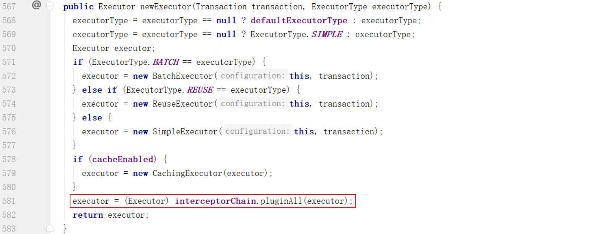

## 1. mybatis分页插件PageHelper实现原理

PageHelper分页的实现是在执行SQL语句之前动态的将分页的SQL拼接进去，从而实现了从数据库中分页查询。

### 1.1 使用方式

首先回顾一下PageHelper插件的使用方式，非常简单，分2步完成：

第一步：在mybatis的SqlMapConfig.xml配置文件中配置插件

~~~xml
<?xml version="1.0" encoding="UTF-8" ?>
<!DOCTYPE configuration PUBLIC "-//mybatis.org//DTD Config 3.0//EN"
        "http://mybatis.org/dtd/mybatis-3-config.dtd">
<configuration>
    <plugins>
        <!-- com.github.pagehelper 为 PageHelper 类所在包名 -->
        <plugin interceptor="com.github.pagehelper.PageHelper">
            <!-- 设置数据库类型 Oracle,Mysql,MariaDB,SQLite,Hsqldb,PostgreSQL 六种数据库-->
            <property name="dialect" value="mysql"/>
        </plugin>
    </plugins>
</configuration>
~~~

第二步：在Java代码中调用插件的API进行分页处理

~~~java
//分页查询
public PageResult findPage(QueryPageBean queryPageBean) {
  Integer currentPage = queryPageBean.getCurrentPage();
  Integer pageSize = queryPageBean.getPageSize();
  String queryString = queryPageBean.getQueryString();
  
  //分页插件会在执行sql之前将分页关键字追加到SQL后面
  PageHelper.startPage(currentPage,pageSize);
  
  Page<CheckItem> page = checkItemDao.findByCondition(queryString);
  return new PageResult(page.getTotal(),page.getResult());
}
~~~

### 1.2 源码分析（项目启动时执行）

SqlSessionFactoryBuilder：

 XMLConfigBuilder：

Configuration：

InterceptorChain：

通过上面的代码，加载了全局配置文件及映射文件同时还将配置的拦截器PageHelper添加到了拦截器链中

上面代码的调用关系如下：

### 1.3 源码分析（项目运行中执行）

PageHelper：

通过上面的代码可以发现，PageHelper插件提供了一个类（PageHelper）实现了Interceptor接口，其本质就是一个拦截器，用于拦截Executor接口的query方法。Executor主要是用于创建Statement对象，在创建过程中依靠 MappedStatement 对象将赋值内容给 sql 占位符进行绑定。

DefaultSqlSessionFactory：

Configuration：

InterceptorChain：

PageHelper：

Plugin：

PageHelper：

SqlUtil：

MappedStatement：

观察控制台，可以看到mybatis框架执行的sql，已经进行了分页处理：

下面的时序图可以看到创建SqlSession对象的过程：

## 2. 自定义mybatis拦截器

MyBatis 自定义拦截器，可以拦截的接口有四种 Executor.class，StatementHandler.class，ParameterHandler.class 和 ResultSetHandler.class。在某种情景下，如果这四种接口自带的某个方法不能满足我们的要求时，就可以在不改动源码的情况下，建立一个自己的拦截器用于拦截接口的某个方法。

自定义mybatis的拦截器，需要实现Mybatis框架提供的Interceptor接口。具体实现过程如下：

第一步：自定义拦截器

~~~java
package com.itheima.interceptor;

import org.apache.ibatis.executor.Executor;
import org.apache.ibatis.mapping.MappedStatement;
import org.apache.ibatis.plugin.*;
import org.apache.ibatis.session.ResultHandler;
import org.apache.ibatis.session.RowBounds;
import java.util.Properties;

/**
 * 自定义mybatis拦截器
 */
@Intercepts(
        @Signature(method = "query",
                type = Executor.class,
                args = {MappedStatement.class, Object.class, RowBounds.class, ResultHandler.class})
)
public class CustomInterceptor implements Interceptor {
    /**
     * 拦截时执行的逻辑
     * @param invocation
     * @return
     * @throws Throwable
     */
    public Object intercept(Invocation invocation) throws Throwable {
        System.out.println("被拦截方法执行前的操作。。。");
        Object proceed = invocation.proceed();
        System.out.println("被拦截方法执行后的操作。。。");
        return proceed;
    }

    /**
     * 拦截器用于封装目标对象
     
     * 通过该方法我们可以返回目标对象本身，也可以返回一个它的代理
     * @param o
     * @return
     */
    public Object plugin(Object o) {
        return Plugin.wrap(o, this);
    }

    /**
     * 用于在 Mybatis 配置文件中指定一些属性
     * @param properties
     */
    public void setProperties(Properties properties) {
    }
}
~~~

第二步：在mybatis配置文件中注册自定义的拦截器

~~~xml
<?xml version="1.0" encoding="UTF-8" ?>
<!DOCTYPE configuration PUBLIC "-//mybatis.org//DTD Config 3.0//EN"
        "http://mybatis.org/dtd/mybatis-3-config.dtd">
<configuration>
    <plugins>
        <!-- com.github.pagehelper 为 PageHelper 类所在包名 -->
        <plugin interceptor="com.github.pagehelper.PageHelper">
            <!-- 设置数据库类型 Oracle,Mysql,MariaDB,SQLite,Hsqldb,PostgreSQL 六种数据库-->
            <property name="dialect" value="mysql"/>
        </plugin>
      	<!--注册自定义拦截器-->
        <plugin interceptor="com.itheima.interceptor.CustomInterceptor"></plugin>
    </plugins>
</configuration>
~~~

可以通过断点调试方式确定自定义拦截器是否生效。
