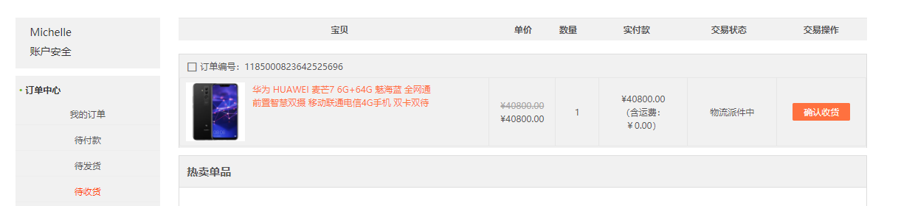
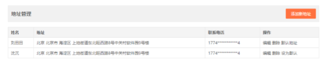
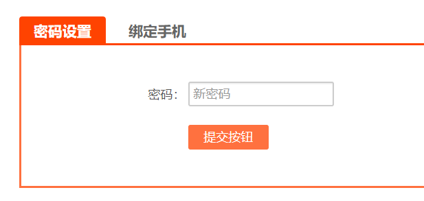

# 项目实战

## 1.用户中心（50分）

### 1.1订单中心（20分）

#### 1.1.1 我的订单（5分）

根据当前登陆人姓名查询当前用户的所有订单信息

#### 1.1.2 待付款（5分）

展示当前用户待付款列表，并实现立即付款和取消订单

#### 1.1.3 待发货（5分）

展示当前用户待发货列表，并实现提醒发货发送短信

#### 1.1.4 待收货（5分）

展示当前用户待收货列表，并实现确认收货

### 1.2 我的中心（10分）

#### 1.2.1 收藏（5分）

显示收藏商品列表，当用户在搜索结果页面点击收藏后，将商品进行收藏。

#### 1.2.2 足迹（5分）

显示足迹列表，当用户在搜索结果页面跳转商品详情页时，异步添加该商品足迹信息。

### 1.3 设置（20分）

#### 1.3.1 个人信息（5分）

补充个人信息

#### 1.3.2 上传头像（5分）

#### 1.3.3 地址管理（5分）

地址管理列表的渲染，添加新地址，编辑和删除地址功能

#### 1.3.4 安全管理（5分） 

实现密码修改的功能

绑定手机

## 2.评价（50分） 

### 2.1 mongodb（10分）

####  2.1.1 mongodb容器化（5分） 

使用docker容器搭建mongodb环境

####  2.1.2 设计评论的数据结构（5分）

###  2.2 评价微服务（20分） 

#### 2.2.1 实体类层创建（5分） 

#### 2.2.2 数据持久层的创建（5分） 

使用SpringData MongoDb完成

####  2.2.3 添加评论的业务逻辑方法（5分） 

包括服务层接口、服务层实现、控制层方法

#### 2.2.4 根据商品Id查询评论的方法（5分） 

包括服务层接口、服务层实现、控制层方法 

### 2.3 用户中心-评价（10分） 

#### 2.3.1 订单中心-待评价订单列表（5分） 

实现订单中心-待评价订单列表的渲染

#### 2.3.2 评价（5分） 

实现对该订单商品的评价功能

### 2.4 商品详细页（10分）

####  2.4.1 评价列表显示（5分） 

#### 2.4.2 评论数更新与显示（5分）

编写定时任务，定时更新商品表中的评论数，在商品详细页加载时进行异步读取（使用 缓存优化）。

